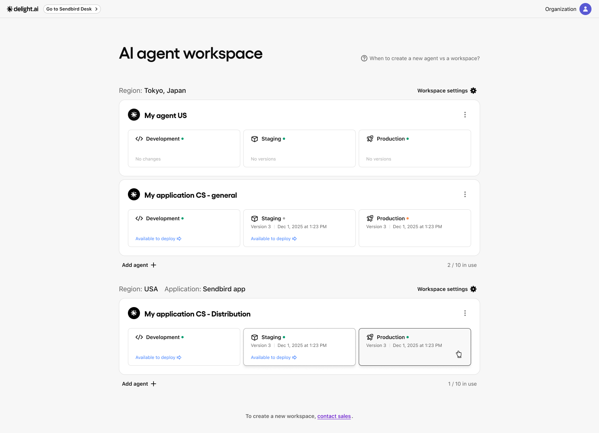
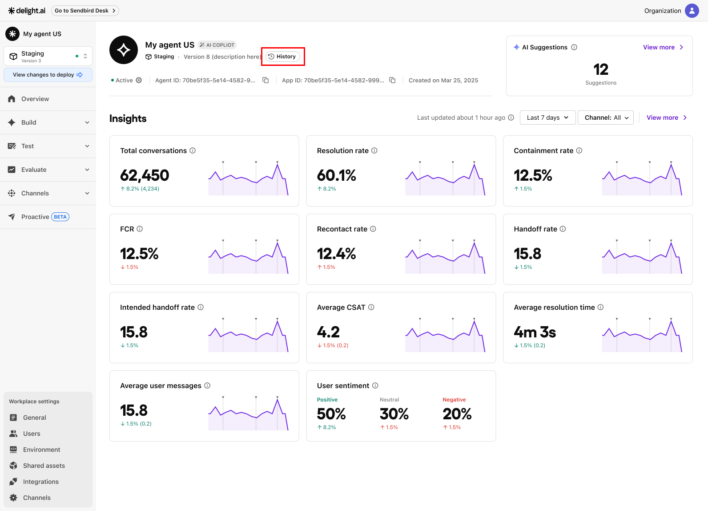
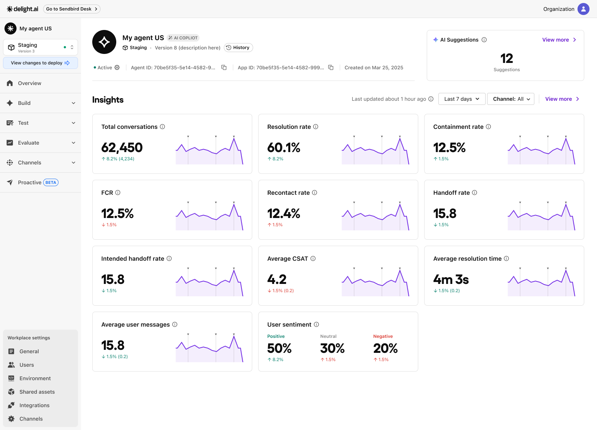

# AI agent (home)

In the Delight AI Agent dashboard, you can configure agent behavior, manage shared assets, and deploy agents across environments. This page introduces the core concepts of AI agents and explains what you can do on the **Home** and **Overview** pages.

***

## Core concepts

This section introduces the key concepts referenced throughout the user guide.

#### Workspace vs. AI agent

A **workspace** is the shared environment where your AI agents operate. A single workspace can contain multiple agents and shared assets, such as knowledge data.

<table><thead><tr><th width="192.26953125">Concept</th><th>Description</th></tr></thead><tbody><tr><td>Workspace</td><td>A region-based container. All agents in a workspace share instructional assets such as Knowledge, Actionbooks, Tools, and Message templates.</td></tr><tr><td>AI agent</td><td>A uniquely configured entity with its own behavior, language, and use case.</td></tr></tbody></table>

If not sure where to start, use this rule of thumb:

* **Create a new workspace** if you need to serve users in a completely different region (e.g. US vs Korea).
* **Create a new agent** if you want to serve different audiences, policies, or languages within the same region.


To create a new workspace, contact contact one of our Delight representative.


#### Development, Staging, and Production environments

Once you've created a workspace, you need to build a new AI agent. Delight AI agent automatically comes with three environments:

<table><thead><tr><th width="207.5390625">Environment</th><th>Purpose</th></tr></thead><tbody><tr><td>Development</td><td>A sandbox for testing, editing, and validating your agent before going live.</td></tr><tr><td>Staging</td><td>A pre-production environment for a final validation and quality assurance of changes from <strong>Development</strong>. </td></tr><tr><td>Production</td><td>The live version users interact with.</td></tr></tbody></table>

Modifications in **Development** and **Staging** do not impact the live agent until they are deployed to Production.


You can edit agents only in **Development**. **Staging** and **Production** are read-only.


***

## Home

First, the **Home** page showcases all the workspaces and AI agents you've built in them. You can manage your workspace settings and create more AI agents when needed.

<figure><figcaption></figcaption></figure>


The AI agent list view may vary based on your [role and permission](https://docs.delight.ai/roles-and-permissions) settings within the workspace.


### Create more AI agents

Depending on your service environment, you might need more than one AI agents - one for Sales, one for Customer service, and one for Technical assistance. Click the **Add Agent➕** button below the list of agent cards to create a new agent. You'll be asked to:

* Name the agent (visible to users).

Each new agent will come with three environments: [Development, Staging, and Production](ai-agent-home.md#development-vs-production-environments).


To delete an agent, contact one of our Delight representative.


### Manage workspace settings

You can find the Workspace settings button above the list of AI agents. This allows you to specify the system prompt to apply to AI agents across the workspace, build knowledge assets that will be shared among them, and manage 3rd party platform integrations, and more.&#x20;

<figure><figcaption></figcaption></figure>

***

## Overview&#x20;

The **Overview** page provides at-a-glance insight into an AI agent's performance and user satisfaction. You can also deploy or revert changes you've made in **Development** to **Staging** and **Production**.

<figure><figcaption></figcaption></figure>

### View and deploy changes

If there are updates in the **Development** environment that haven’t been deployed, a statement "**Available to deploy**" will appear on the agent card.

Click the agent card. You can find the **View changes to deploy** button at the top of left menu bar. Review the changes and choose to either deploy all or deploy selectively.


To apply changes from **Development** on a production level, deploy changes to both **Staging** and then **Production**.&#x20;


**Selective deployment**

Selective deployment lets you control which AI agents receive workspace-level changes. For example, when you update a shared **Actionbook** or **Knowledge** item in **Development**, you can choose which agents receive the update in **Staging** and **Production**.

This allows you to:

* Gradually roll out updates to specific agents
* Run A/B tests across agents
* Prevent unintended changes to agents that share the same workspace assets

### View deployment history

Click **History** in **Staging** and **Production** environments to view past deployments.

<figure><figcaption></figcaption></figure>

<figure><figcaption></figcaption></figure>

Each record shows:

* The version number
* Who deployed it
* When it was deployed
* Details of the modified items
* Restore button\*


Version history is available in **Staging** and **Production** only.


*How to revert deployment

After deployment, you can revert the change with a click. Each environment offers different ways to roll back your recent deployments.

**Development**

1. On the **Overview** page, click **Reset changes** in the **Development** environment. This button appears in the same location as **History** in the **Staging** environment and resets **Development** to the current **Staging** version.

**Staging and Production**

1. On the **Overview** page, click the **History** button to open the **Version history** modal.
2. Find an agent version to roll your **Staging** or **Production** back to.&#x20;
3. Click the **Restore** button in the far right column of the table.&#x20;
4. Select what changes to revert from the current settings.
5. Leave a note about why you are reverting the deployment and type in your organization name to proceed.

### Manage AI agent's operational state

You can activate or deactivate an agent in its Overview page. Click its **Active** status button and toggle the agent between **Active** and **Inactive**:

\[image]

* **Active**: The AI agent is up and running, and available to users.
* **Inactive**: The agent stops operating, and the specified fallback message will be sent as a response instead.


Toggling the agent in one environment doesn’t affect the others.


### Monitor AI agent's performance

The **Overview** page also displays key metrics for AI agent performance and user satisfaction over the selected time period. The default range is the last 7 days, and vertical lines on the graph indicate version updates.

<figure><figcaption></figcaption></figure>
