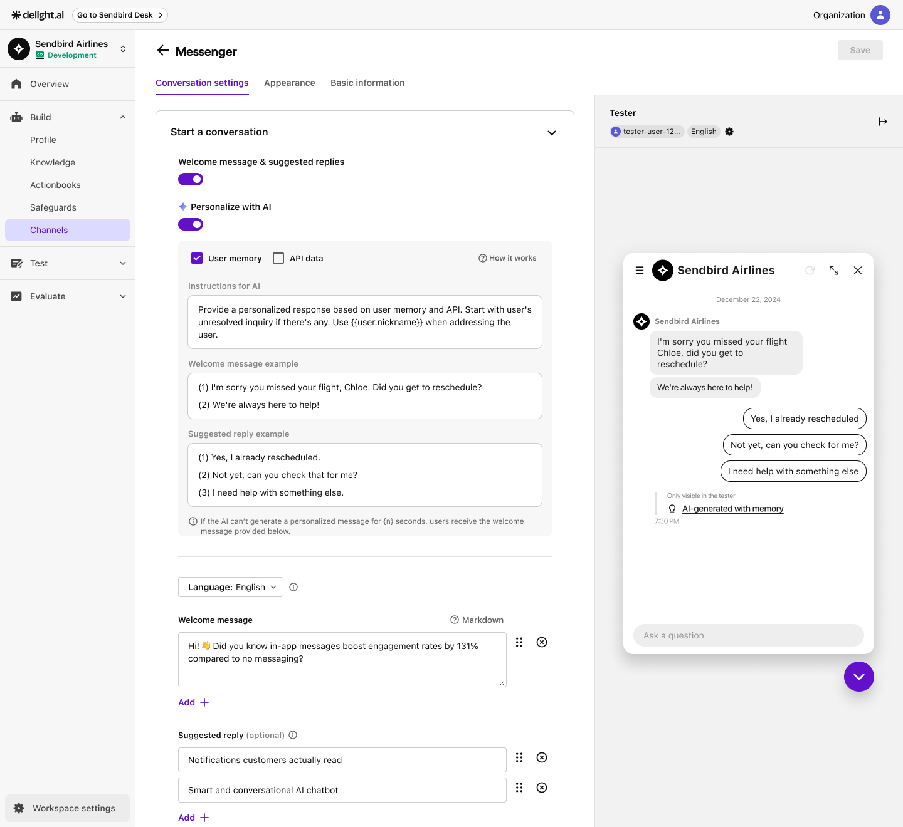

# For You Conversation

AI agent can offer a **For You Conversation (FYC)** - a personalized welcome message and suggested replies for more customized user experience. Using past conversations and API tool calls, AI agent can dynamically generate messages that best suits the user's preferences and needs.

## How it works

FYC utilizes the following sources to generate personalized messages:

* User memory: AI agent can seep through past conversations, up to 1,000 messages per conversation.&#x20;
* API data: Using Tools you've preset, AI agent can pull user-related data from your server and customize the welcome message or suggested replies to enhance communication efficiency.
* Context object: each conversation also contains user-related data in a `context` object. AI agent would also refer to the information in the object when generating a FYC message.

<figure><figcaption></figcaption></figure>

## How to use

* Welcome message in Messenger: Follow the steps below.

1. Navigate to **Build > Channels > Messenger** in the left menu bar of Delight AI agent dashboard.
2. In the **Conversation settings** tab, toggle on **Welcome message & suggested replies** in the **Start a conversation** section.
3. Toggle on Personalize with AI to let AI agent customize the welcome message and suggested replies when a conversation opens.
4. Check whether AI agent can have access to **User memery** and **API data**. For more personalized assistance, we recommend you check both boxes.
5. Provide **Instructions for AI**, **Welcome message example**, and **Suggested reply example**. AI agent will refer to the guideline and sample messages when sending an actual message.
   1. Instructions for AI example:&#x20;


FYC doesn't require deployment. Instead, save the settings in each AI agent environment, such as **Staging** and **Production**.


<figure><figcaption></figcaption></figure>
