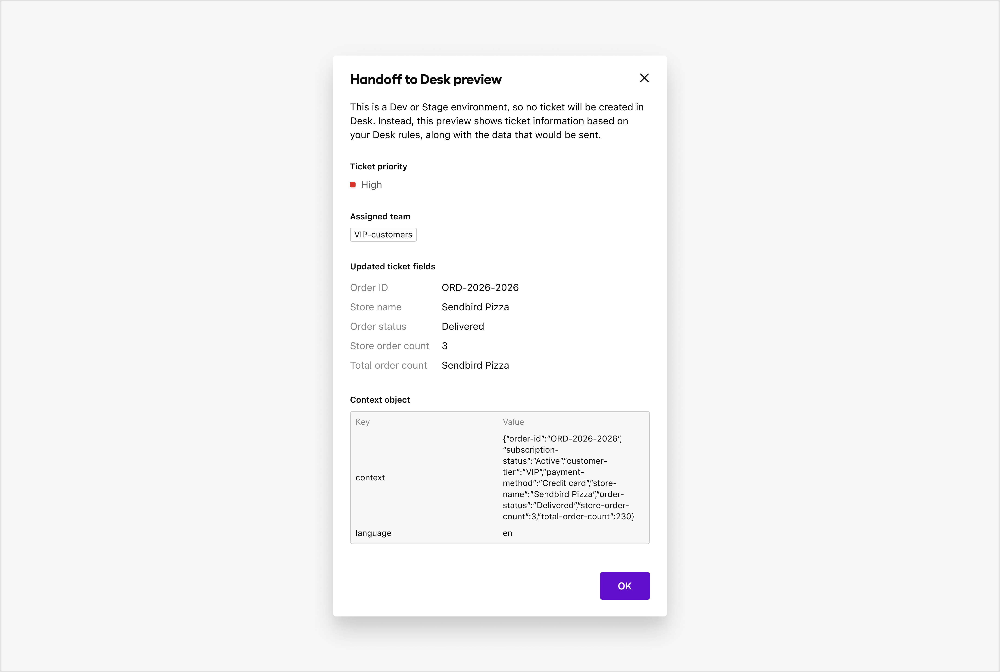
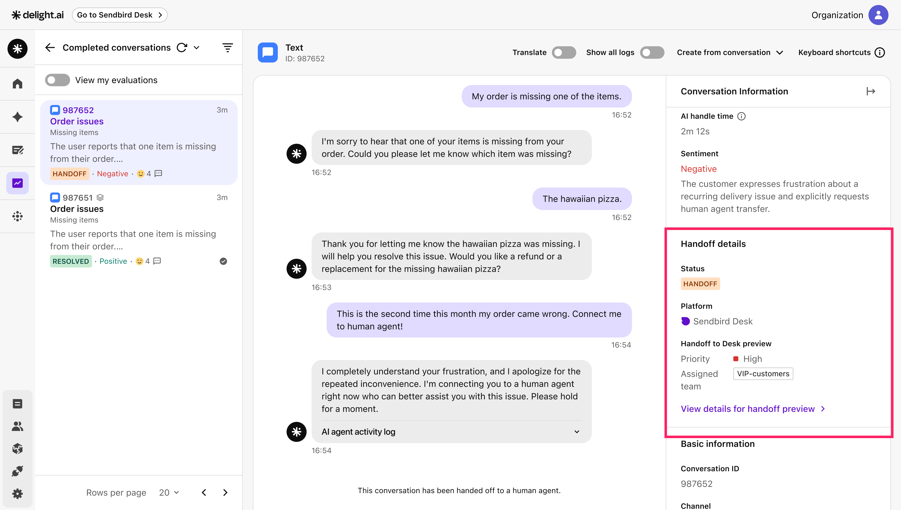
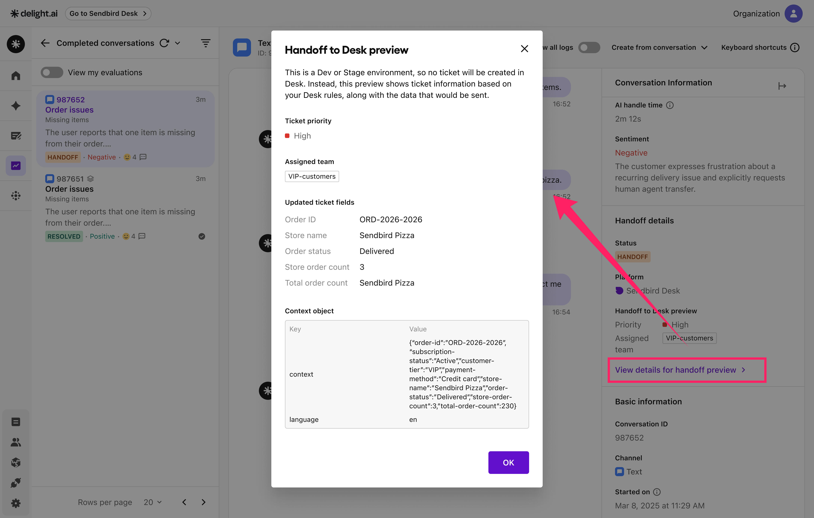

# Handoff

Handoff is a feature that transfers conversations from an AI agent to the other integrated platform. When a handoff occurs, Desk creates a ticket with a specific priority, assigns it to a team, and automatically populates ticket fields based on a context object passed by the AI agent—so human agents can quickly understand the customer's situation.

Handoff to Desk works differently depending on your environment:

<table><thead><tr><th width="276.7308349609375">AI agent environment</th><th>Behavior</th></tr></thead><tbody><tr><td><strong>Test:</strong> Development / Staging</td><td>Displays a <a href="handoff.md#handoff-preview"><strong>handoff preview</strong></a> without creating an actual Desk ticket.</td></tr><tr><td><strong>Live:</strong> Production</td><td>Creates a Desk ticket with <a href="handoff.md#auto-populated-ticket-fields"><strong>auto-populated ticket fields</strong></a>.</td></tr></tbody></table>

***

## Prerequisites

* Sendbird Desk integration is enabled.
* Context object is set up.
  * A context object is a key-value store that sends customer-specific information to the AI agent. It can include business details such as order numbers, membership tiers, or any other data.
  * If you haven't set up a context object yet, refer to the following guides:
    * [DASHBOARD GUIDE > Users > Pass a context object to AI agents](../../users.md#pass-a-context-object-to-ai-agents)
    * [SDK DOCS > iOS > Context object](../../../sdk-docs/ios/context-object.md)
    * [SDK DOCS > Android > Context object](../../../sdk-docs/android/context-object.md)
    * [SDK DOCS > JavaScript (CDN) > Context object](../../../sdk-docs/javascript-cdn/context-object.md)
    * [SDK DOCS > React (npm) > Context object](../../../sdk-docs/react-npm/context-object.md)
    * [PLATFORM API > Context object for messenger channel](../../../platform-api/context-object-for-messenger-channel.md)
* Desk assignment and priority rules are configured.
  * To configure the rules, go to **Settings > Desk > Rules** on the Sendbird dashboard. For more information, see [Desk guide](https://sendbird.com/docs/desk/guide/v1/rules/assignment-rules).
  * If you don't have any assignment or priority rules configured in Desk, tickets will be assigned to the default team with medium priority.

***

## Handoff preview

When you trigger a handoff in a Development or Staging environment, Delight AI displays a preview instead of creating an actual Desk ticket. This preview shows the ticket priority and assigned team based on Desk rules, the custom ticket fields that would be auto-populated, and the context object. It helps you verify the entire process from AI agent conversation to Desk handoff without affecting your live Desk workspace.


To create an actual Desk ticket regardless of the environment, contact us to turn off this feature.


<figure><figcaption></figcaption></figure>

***

### How to access

#### Step 1: Trigger a handoff and see the conversation details

1. Start a conversation with your AI agent in a Dev or Stage environment and trigger a handoff.
2. Go to **Evaluate > Reports > Conversations** on the Delight AI dashboard.
3. Click a conversation to see the conversation details.

<figure><figcaption></figcaption></figure>

#### Step 2: See the handoff preview

In the **Conversation Information** panel, find the **Handoff details** section. Click **View details for handoff preview** to open the preview modal.

<figure><figcaption></figcaption></figure>

The modal displays:

* **Ticket priority**: The ticket priority based on Desk's priority rules.
* **Assigned team**: The assigned team based on Desk's assignment rules.
* **Updated ticket fields**: Desk ticket field values populated from the context object.
* **Context object**: Full context data passed during handoff.

***

## Auto-populated ticket fields

When a handoff occurs in a Production environment, the AI agent passes customer-specific information called a context object to Desk. Desk uses this context object to automatically populate any ticket fields that match the fields in the context object.



***

### How to access

#### Step 1: Check your custom ticket fields

1. Go to **Settings > Desk > Ticket fields** on the Sendbird dashboard.
2. Verify the ticket field keys you want to populate. If you don't have any fields, create them.
3. Only ticket fields whose keys **exactly match** the context object's field keys will be populated.


The context object's field keys must follow the Desk field key convention: only lowercase letters, numbers, and dashes.




#### Step 2: Trigger a handoff from the AI agent to Desk in a Production environment

Any ticket fields that match the context object’s fields will appear in the ticket fields section of the ticket view, so you don’t need to update the values manually.
