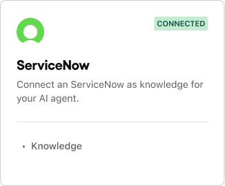

# ServiceNow

The ServiceNow integration with Delight AI agent enables us to extract all the internal spaces and pages that you've created. This integration allows you to:

* Leverage Knowledge articles for instant answers: AI Agents can access all knowledge base content in the platform. This allows the AI Agent to retrieve relevant articles, FAQs, and documentation to provide accurate, self-serve responses before escalating to human support.

***

## **How to integrate**

### **Step 1:** Provide your ServiceNow API credentials.

To integrate, Delight AI agent will need the following information:

<table><thead><tr><th width="247.359375">Credentials</th><th>Description</th></tr></thead><tbody><tr><td>ServiceNow Instance URL</td><td>Specify your ServiceNow domain URL</td></tr><tr><td>API credential</td><td>Specify your ServiceNow account's API key. You can find it under <strong>System Web Services > API Access Policies > REST API Key</strong> in ServiceNow.</td></tr></tbody></table>

<figure><figcaption></figcaption></figure>

### Step 2: **Click Connect**

Once you've entered all the required credentials, click **Connect** at the top-right corner of the browser. You will then see a confirmation label on the ServiceNow tile indicating that the integration has been successfully established.

<figure><figcaption></figcaption></figure>

***

## **What's next**

### **Sync ServiceNow articles as knowledge**

If you have any guidelines or articles that your AI agent can reference, go to the [Shared assets > Knowledge](../shared-assets/knowledge.md) menu in the dashboard and sync them to Delight AI agent. When your ServiceNow articles are updated, re-sync them to keep the agent’s knowledge up to date.
