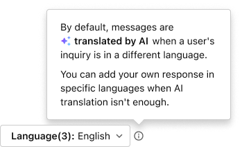
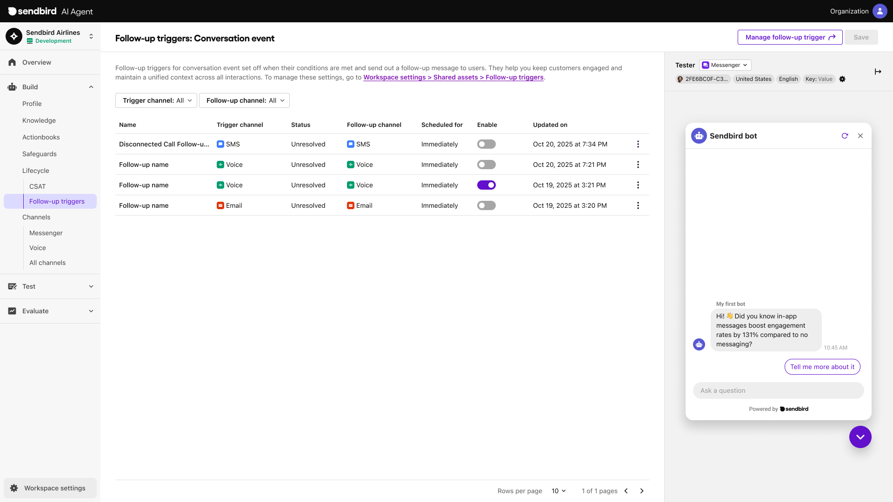

# Follow-up triggers

Utilize follow-up triggers to enhance communication for users by providing seamless omnichannel support. These triggers activate specific actions, such as shifting conversations to different channels or making an API call, offering improved assistance with user inquiries.

***

## Types

Delight AI agent supports triggers for two types of events: conversation event and actionbook event.

<table><thead><tr><th width="163.03125">Event</th><th>Trigger condition</th><th>Action</th></tr></thead><tbody><tr><td>Conversation</td><td>When a conversation ends</td><td>it create a new conversation.</td></tr><tr><td>Actionbook</td><td>When an actionbook is called</td><td>it create a new conversation.</td></tr></tbody></table>

***

## How to create&#x20;

You can create and manage triggers under **Workspace settings > Shared assets > Follow-up triggers**.

<figure><figcaption></figcaption></figure>

### Conversation event trigger

1. Navigate to the **Conversation event** tab in **Workspace settings > Shared assets > Follow-up triggers**.
2. Click **Add+** in the top-right corner of the screen.
3. Configure the name and flow of the trigger.
   1. Flow - Condition: you can set a condition when the trigger should be initiated
      1. Channel
      2. Resolution status
   2. Flow - Acton: you can determine which channel to use when starting a follow-up conversation with the user. When creating a new conversation, AI will send an opening message to the user.&#x20;
      1. Channel
      2. Resolution status
      3. Message: Provide an instruction and a message sample for your AI agent to reference. You can determine whether to let the agent refer to user memories when generating the message.


user memory - link to FYC message


<figure><figcaption></figcaption></figure>

### Actionbook event trigger

1. Navigate to the **Actionboon event** tab in **Workspace settings > Shared assets > Follow-up triggers**.
2. Click **Create trigger+** in the top-right corner of the screen.
3. Configure the name and flow of the trigger.
   1. Flow - Condition: you can set a condition when the trigger should be initiated
      1. Channel
      2. Resolution status
   2. Flow - Acton: you can determine which channel to use when starting a follow-up conversation with the user. When creating a new conversation, AI will send an opening message to the user.&#x20;
      1. Channel
      2. Resolution status
      3. Message: Provide an instruction and a message sample for your AI agent to reference. You can determine whether to let the agent refer to user memories when generating the message.

<figure><figcaption></figcaption></figure>

#### Message translation

For the notification messages in Actionbook event triggers,  AI agent supports message translation and localization. You can add up to five languages and compose a notification message in them. If they aren't provided, your message will be AI-translated into a user's preferred language.

<figure><figcaption></figcaption></figure>

***

## How to manage&#x20;

adfafas

### Conversation event triggers

<figure><figcaption></figcaption></figure>

### Actionbook event triggers

dfdf

<figure><figcaption></figcaption></figure>

afdf

***

## Conversation group

Utilize triggers to create a seamless omnichannel customer experience by consolidating scattered conversations into a single, unified customer support stream.

### Channel sequence

In the Conversation Details view, you can track the cross-channel interactions between your AI agent and a user. This section offers a clear overview and detailed metrics on omnichannel communications, known as the Channel sequence.&#x20;

### Conversation group insights

The timeline and summary in the Conversation Group panel provide a quick understanding of conversation history and valuable customer insights.

### Conversation group message count

The number of AI-generated messages and user messages from all channels in the channel sequence.
