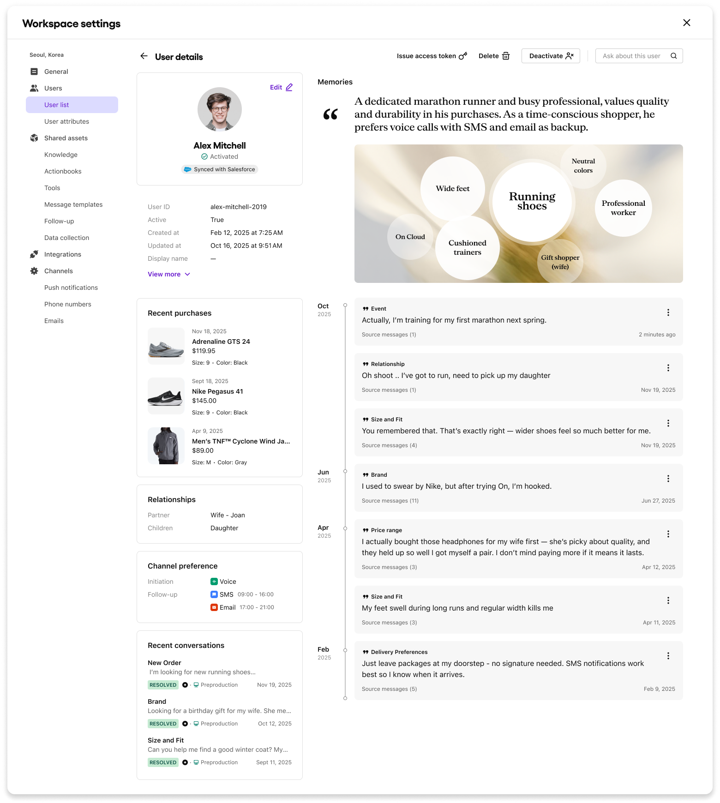
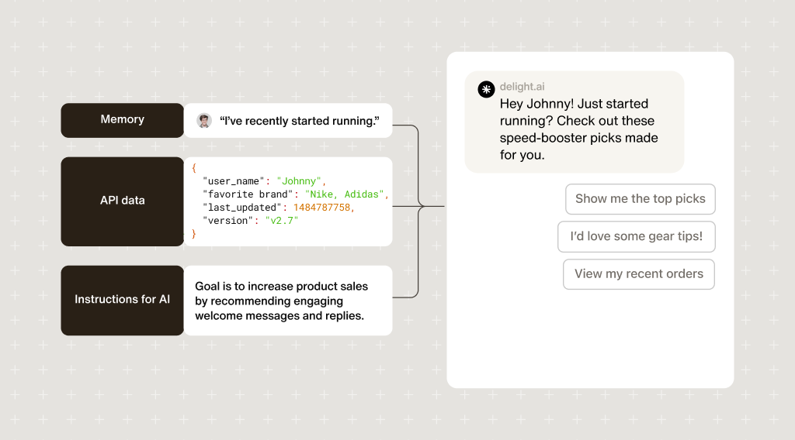

# Memory

AI agent keeps track of conversation it had with a user and turns key points into Memories. These memories help AI agent to provide more personalized and on-point service to users by referencing conversation history and so on...

***

## User information

The AI agent can gather conversation snippets from users to build a personalized database for each. These snippets are called Memories. Building memories enables the agent to deliver tailored customer support and optimize the consultation process by understanding each user's unique characteristics. Navigate to **Workspace settings > Users > User list** to access and manage snippets in each user's **User details** view.

<figure><figcaption></figcaption></figure>

***

### For You conversations (FYC)

AI agents can send hyper-personalized messages, called **For You Conversations**. By using a Tools call and AI instructions, the agents can deliver engaging messages tailored to the user's specific needs and preferences.

<figure><figcaption></figcaption></figure>

FYC is currently available whenever a welcome message is delivered to users. Supported features include:

* Follow-up triggers
* Meseenger channel's [Conversation settings](../build/channels/messenger/conversation-settings/)
