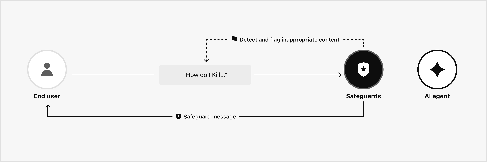

# Safeguards

Delight AI Agent provides multiple layers of safeguards designed to secure instructions and prevent misuse.


For more information, see: [Safeguards setting guide](../../dashboard-guide/build/safeguards.md)


<figure><figcaption></figcaption></figure>

* **Guardrails:** Built-in controls that automatically detect and flag inappropriate content before it reaches the AI agent, and validate outputs before they are sent to end users.
* **Adversarial defense:** Security features that protect against malicious techniques such as prompt injection and jailbreaking attempts intended to manipulate agent behavior.
* **Banned words and phrases:** Allows organizations to block explicit terms, sensitive topics, or competitor mentions.
* **PII:** Prevents personally identifiable information (PII), such as phone numbers and email addresses, from appearing in conversations.
* **Safeguard message:** Predefine a message to send when conversations trigger guardrails, adversarial attacks, or banned words and phrases.
* **Low-confidence protection:** Identifies and validates responses with low confidence. If an AI agent generates responses that are not grounded in the provided knowledge sources, they are categorized as low-confidence messages.


**Note:** Messages detected by safeguards are flagged and can be monitored in [Evaluate > Flagged messages](../../dashboard-guide/evaluate/flagged-messages.md).

