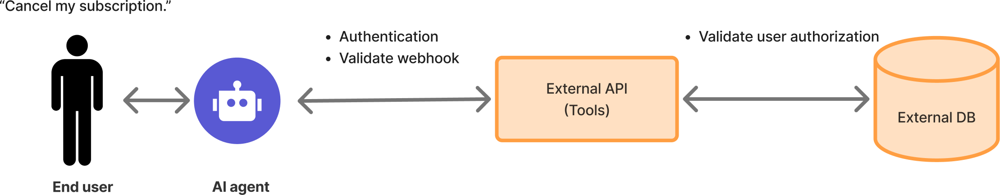

# Personally Identifiable Information

<figure><figcaption></figcaption></figure>

Handling Personally Identifiable Information (PII) is a critical priority for any enterprise. A robust strategy is essential for both data privacy and regulatory compliance. Delight AI provides the following features to help organizations effectively manage PII.

***

### Data Privacy and Protection Commitment

Delight AI is committed to protecting customer data and adhering to privacy principles. Our policy on data minimization and the use of customer data for training purposes is as follows:

#### Data Minimization

Delight AI only collects and processes data that is absolutely necessary for the provision and improvement of the AI agent service. We strive to minimize the amount of personally identifiable information and other sensitive data handled by the platform.

#### No Training on Customer Data

Delight AI explicitly does not use customer-specific content, conversations, knowledge bases, or other proprietary data for training our foundational AI models. Any data handled by our AI agent for customer interactions is kept separate and is not included in our model training datasets. This ensures your intellectual property and sensitive information stay confidential and secure, preventing accidental exposure or misuse.

#### Customer Control

Customers retain full control over their data within the Delight AI agent. You have the ability to manage, update, and delete your data as needed, ensuring compliance with your internal policies and regulatory requirements.

#### Data Storage Location Regulation

Delight AI stores PII data only within the customer's region and does not transfer or store it in other regions.

***

### PII Masking

<figure><figcaption></figcaption></figure>

Delight AI includes a PII masking feature that, when enabled, masks personally identifiable information such as phone numbers, emails, and other sensitive data from appearing in dashboard conversation history and databases.

This feature uses data redaction, replacing sensitive values with placeholder characters to hide the original data. PII masking is a key security measure that reduces exposure to sensitive information and helps ensure compliance with data protection regulations.

***

### Role-Based Access Control

Sendbird provides role-based access control (RBAC) for managing access to data. This feature allows administrators to grant or restrict access to PII based on user roles, ensuring that only authorized users can view sensitive information. By limiting access at a granular level, organizations can minimize unnecessary exposure of PII and enforce stricter data privacy policies.


For more information, see: [Roles and permissions](../../dashboard-guide/roles-and-permissions.md)

